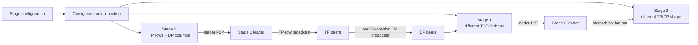
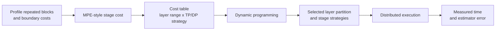

# Heterogeneous Parallelism for Distributed LLM Training

This project is a public-safe reconstruction of my POSTECH undergraduate research on extending a PyTorch LLM training framework to represent, execute, and search pipeline stages with different tensor- and data-parallel configurations. The engineering focus was stage-specific process groups, rank allocation, communication across unequal TP widths, profiling-derived cost estimation, and dynamic-programming configuration search.

> This repository contains newly written, hardware-independent planning and search code. It does not redistribute Picotron source, private lab infrastructure, raw profiling logs, model weights, or datasets.

## Problem

A conventional hybrid-parallel configuration applies the same TP/DP shape to every pipeline stage. That is simple to initialize, but it excludes plans such as a TP-heavy stage followed by a DP-heavy stage.

Removing that restriction creates a systems problem. Adjacent stages can have different process-group sizes, so ranks no longer line up one-to-one across a pipeline boundary. The runtime must allocate ranks per stage, create the correct TP and DP groups, choose communication leaders, and redistribute activations and gradients without using an invalid collective source.

## What I Built

My research changes to the Picotron-based prototype covered:

- configuration-driven heterogeneous TP/DP choices across pipeline stages;
- stage-specific TP and DP process-group construction;
- dynamic assignment of global GPU ranks to disjoint stages;
- leader-based pipeline communication and hierarchical intra-stage fan-out;
- profiling-derived performance estimates for repeated Transformer blocks;
- dynamic-programming search over layer partitions and TP/DP strategies;
- an eight-GPU evaluation across 189 TinyLlama-1.1B configurations.

Picotron already provided the educational Llama model, tensor/data parallel layers, and pipeline scheduling foundation. The research contribution was the heterogeneous topology, boundary communication, measurement, and search layer around that foundation. The public modules in `src/heteropipe` reconstruct those contributions without copying the upstream training runtime.

## System Architecture

### Runtime



### Configuration search



See [Architecture](docs/architecture.md) for the rank grid and communication sequence.

## Communication Design

For a receiving stage with `TP=2, DP=2`, four ranks form two TP rows and two DP columns. The stage leader receives the previous stage's activation, broadcasts it across the first TP row, and each TP position then broadcasts down its DP column.

```text
leader P2P receive
       |
       v
first TP row:  rank 0 ----> rank 1
                  |            |
                  v            v
DP columns:     rank 2       rank 3
```

This ordering ensures that every broadcast source belongs to the corresponding process group. The planner and invariant tests are in [`topology.py`](src/heteropipe/topology.py) and [`test_topology.py`](tests/test_topology.py).

## Configuration Search

The search considers:

- pipeline layer boundaries;
- the device count assigned to each stage;
- a TP/DP strategy for every stage;
- the estimated computation and communication cost of each candidate.

For `B` microbatches, it minimizes:

```text
sum(stage costs) + (B - 1) * max(stage cost)
```

The first term represents fill/drain work; the second represents steady-state bottleneck cost. [`search.py`](src/heteropipe/search.py) evaluates candidate bottleneck thresholds and runs a dynamic program over layer coverage and device count.

## Experimental Setup

| Item | Value |
|---|---:|
| Model | TinyLlama-1.1B |
| Transformer layers | 22 |
| GPUs | 8 |
| Pipeline stages | 2 |
| Per-stage choices | TP1_DP4, TP2_DP2, TP4_DP1 |
| Strategy pairs | 9 |
| Layer partitions | 21 |
| Evaluated configurations | 189 |

The retained publication-safe artifacts do not identify the GPU model, so this repository does not guess it.

## Results

The profiling-derived estimator had **5.85% mean absolute prediction error** against measured net time across 189 recorded configurations.

The selected plan used an even 11/11 layer split and `TP1_DP4` in both stages, with an estimated 1F1B latency of 5,350.04 ms for eight microbatches. The best plan was therefore homogeneous. TinyLlama's relatively uniform blocks did not make heterogeneity beneficial in this workload.

That result is an important boundary on the claim: this work enabled heterogeneous configurations to be executed, modeled, and compared; it did **not** demonstrate a heterogeneous speedup.

The complete aggregate table and metric definition are in [Results](docs/results.md). Machine-readable summaries are under [`results/`](results/).

## Engineering Takeaways

This project demonstrates work at the boundary between distributed runtime design and performance optimization:

- reasoning about global ranks and overlapping collective groups;
- separating pipeline, tensor, and data-parallel communication;
- designing a valid fan-out path across unequal TP widths;
- turning low-level measurements into a search cost model;
- expressing pipeline selection as a constrained dynamic program;
- validating claims against archived measurements instead of assuming heterogeneity wins.

## Repository Structure

```text
src/heteropipe/       validated config, topology, estimator, and DP search
tests/                CPU-only invariant and algorithm tests
examples/             runnable topology and search demonstrations
results/              publication-safe aggregate results
scripts/              local result summarization utility
docs/                 architecture, methodology, and limitations
```

## Run the Public Reconstruction

Python 3.10 or newer is sufficient; the public modules have no runtime dependencies.

```bash
python -m pip install -e .
python -m unittest discover -s tests -v
python examples/inspect_topology.py
python examples/search_demo.py
```

To recompute the aggregate error from an authorized local copy of the archived CSV:

```bash
python scripts/summarize_results.py /path/to/mpe_search_results.csv --expect-rows 189
```

Reproducing the original distributed run requires an eight-GPU environment, the upstream training framework, and artifacts that are intentionally not included here. The CPU examples test topology and search invariants; they do not simulate GPU kernels or claim to reproduce the measured 5.85% result.

## Limitations and Future Work

- Only one model and one eight-GPU scale point were evaluated.
- Uniform Transformer blocks reduce the chance that heterogeneous stages are optimal.
- The estimator assumes relatively stable marginal block cost.
- The leader-based path is simpler than a general all-to-all activation resharder.
- The archived experiment did not establish unique-sample data-parallel scaling.
- Future evaluation should retain publication-safe hardware/interconnect metadata and include MoE or otherwise non-uniform workloads.

## Attribution and Publication Status

The original prototype was based on the public [Picotron tutorial](https://github.com/huggingface/picotron_tutorial). Upstream functionality is not presented as my work, and upstream source is not redistributed here. See [NOTICE.md](NOTICE.md) before publishing or selecting a repository license.
