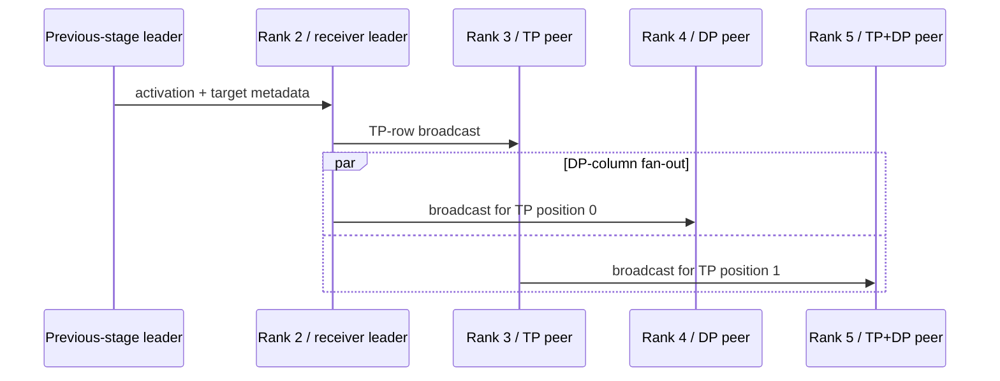

# Architecture

The research prototype changed two connected parts of a distributed LLM training system: the runtime topology and the configuration-selection loop. This public reconstruction represents those decisions without redistributing the upstream training framework.

## Runtime topology

Each pipeline stage owns a disjoint range of global GPU ranks. Within the range, ranks are arranged as a `DP x TP` grid:

- each row is a tensor-parallel group;
- each column is a data-parallel group;
- the first rank is the stage leader;
- adjacent pipeline stages communicate through their leaders.

For a receiving stage with `TP=2, DP=2` and ranks `2..5`, the group plan is:

```text
DP x TP grid

          TP position 0   TP position 1
DP row 0       rank 2          rank 3
DP row 1       rank 4          rank 5

TP groups: (2,3), (4,5)
DP groups: (2,4), (3,5)
leader:    rank 2
```

The leader receives the activation from the previous stage. It first broadcasts across `(2,3)`. Rank 2 and rank 3 then broadcast down `(2,4)` and `(3,5)` respectively. Every collective source is a member of its group, which is essential for mixed TP/DP stages.



This mechanism is a deliberately simple leader-based redistribution scheme. It is suitable for executing and timing stage topologies where adjacent TP widths differ. It is not presented as a general all-to-all resharding algorithm.

## Search architecture

Candidate stage costs are indexed by layer range and parallel strategy. The search minimizes the standard pipeline latency objective

```text
sum(stage costs) + (microbatches - 1) * max(stage cost)
```

subject to complete layer coverage and the available device budget. The implementation iterates possible bottleneck thresholds and uses dynamic programming to minimize fill/drain cost under each threshold.

The public modules are intentionally separated:

- `config.py` validates stage and device invariants;
- `topology.py` plans rank allocation and collective groups;
- `estimator.py` exposes repeated-block cost estimation;
- `search.py` selects a feasible pipeline plan from a cost table.
